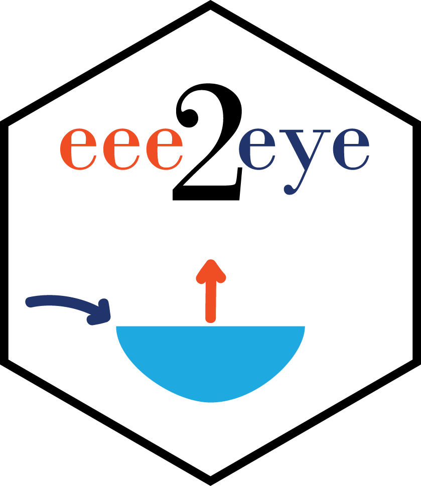

# eee2eye 

## Calculating E:I Values from δ^18^O-H~2~O (‰)

Please see 'EI-Calculations.pdf' in the 'man/ei_calcs' folder for a step-by-step description of the Isotope Mass Balance used to calculate E:I.

Briefly, this function calculates E:I ratios, based on δ18O-H~2~O data. Environmental conditions (i.e. evaporation rate, humidity, temperatures, etc.) are set for the sub-arctic around Yellowknife, NT.

The function is based on a table with the following input parameters per sample:  
- dL (‰) = -11.77, steady-state lake isotope value (measured value from field)  
- dI (‰) = -20.7, source water, likely precipitation (value from Gibson 2001 and GNIP 1999)  
- dP (‰) = -23, average value during evaporation season (signal of rain)  
- temp (C) = 14.3, average temp. on lake (from Gibson & Reid, 2010)  
- humid (dec) = 0.68, relative humidity (from Gibson & Reid, 2010)  
- k = 0.7, estimated for our area

## Installation

```{r, include = FALSE}
# install.packages("remotes")
remotes::install_github("paukes/eee2eye")
```

```{r, eval = FALSE}
remotes::install_github("paukes/eee2eye")
```

## Example

Load the package

```{r}
library(eee2eye)
```

Add E:I ratios to the `data.frame` of field data:
```{r}
# create example database
ei_input <- data.frame(dL_permille = c(-11.77, -15.67, -18.23),
                       dI_permille = c(-20.7, -18.2, -20.2),
                       dP_permille = c(-23, -28, -32), 
                       temp_C = c(14.3, 12.1, 8.9), 
                       h_dec = c(0.68, 0.71, 0.58), 
                       k = c(0.7, 0.72, 0.65))

# add calculated E:I values
ei_input <- eee2eye(ei_input, 'dL_permille', 'dI_permille', 'dP_permille', 'temp_C', 'h_dec', 'k')

```

Add E:I ratios to a `data.frame` of field data when not all input values are known or estimated for each field site so common values can be specified:

```{r}
ei_input <- eee2eye(ei_input, 'dL_permille', -20.7, 'dP_permille', 14.3, 0.68, 0.7)
```

See the [vignette](https://github.com/paukes/eee2eye/blob/master/man/ei_calc/EI-Calculations.pdf) for more information.
